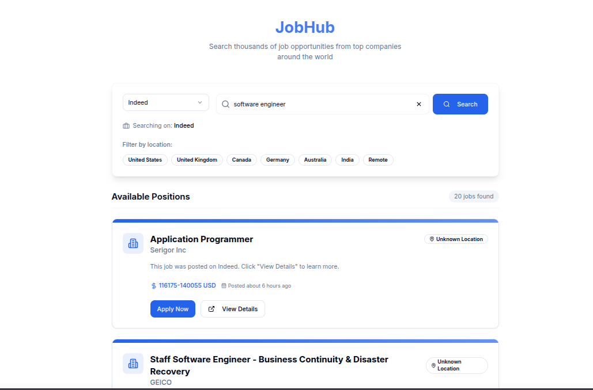

<div style="margin: auto; width: 50%; text-align: center; border: 1px solid black;">
<h1>Jobhub</h1>
</div>

<div style="margin: auto; width: 50%; text-align: center; border: 1px solid black;">
    
</div>

**JobHub** - a simple nextjs / fastapi website that allows you to search for jobs with different parameters.

## Features

- Scrapes job postings from **LinkedIn**, **Indeed**, **ZipRecruiter**, concurrently


### Installation

```
pip install -r requirements.txt
```

_Python version >= [3.10](https://www.python.org/downloads/release/python-3100/) required_

### Usage
-- Post request for /linkdin/get

```json

{
    "skill":"software engineer",
    "location":"usa",
    "pagenumber":2
}


```


-- Post request for /indeed/get | ziprecuter/get

```json

{
    "search_term":"software engineer",
    "google_search_term":"software engineer jobs near San Francisco, CA since yesterday",
    "location":"San Francisco, CA",
    "results_wanted":20,
    "hours_old":12,
    "country_indeed":"USA"
}


```

## Supported Countries for Job Searching

### **LinkedIn**

LinkedIn searches globally & uses only the `location` parameter. 

### **ZipRecruiter**

ZipRecruiter searches for jobs in **US/Canada** & uses only the `location` parameter.

### **Indeed**

Indeed supports most countries, but the `country_indeed` parameter is required. Additionally, use the `location`
parameter to narrow down the location, e.g. city & state if necessary. 

You can specify the following countries when searching on Indeed (use the exact name, * indicates support for Glassdoor):

|                      |              |            |                |
|----------------------|--------------|------------|----------------|
| Argentina            | Australia*   | Austria*   | Bahrain        |
| Belgium*             | Brazil*      | Canada*    | Chile          |
| China                | Colombia     | Costa Rica | Czech Republic |
| Denmark              | Ecuador      | Egypt      | Finland        |
| France*              | Germany*     | Greece     | Hong Kong*     |
| Hungary              | India*       | Indonesia  | Ireland*       |
| Israel               | Italy*       | Japan      | Kuwait         |
| Luxembourg           | Malaysia     | Mexico*    | Morocco        |
| Netherlands*         | New Zealand* | Nigeria    | Norway         |
| Oman                 | Pakistan     | Panama     | Peru           |
| Philippines          | Poland       | Portugal   | Qatar          |
| Romania              | Saudi Arabia | Singapore* | South Africa   |
| South Korea          | Spain*       | Sweden     | Switzerland*   |
| Taiwan               | Thailand     | Turkey     | Ukraine        |
| United Arab Emirates | UK*          | USA*       | Uruguay        |
| Venezuela            | Vietnam*     |            |                |

### **Bayt**

Bayt only uses the search_term parameter currently and searches internationally


## Notes
* Indeed is the best scraper currently with no rate limiting.  
* All the job board endpoints are capped at around 1000 jobs on a given search.  
* LinkedIn is the most restrictive and usually rate limits around the 10th page with one ip. Proxies are a must basically.

## Frequently Asked Questions

---
**Q: Why is Indeed giving unrelated roles?**  
**A:** Indeed searches the description too.

- use - to remove words
- "" for exact match

Example of a good Indeed query

```py
search_term='"engineering intern" software summer (java OR python OR c++) 2025 -tax -marketing'
```

This searches the description/title and must include software, summer, 2025, one of the languages, engineering intern exactly, no tax, no marketing.

---

**Q: No results when using "google"?**  
**A:** You have to use super specific syntax. Search for google jobs on your browser and then whatever pops up in the google jobs search box after applying some filters is what you need to copy & paste into the google_search_term. 

---

**Q: Received a response code 429?**  
**A:** This indicates that you have been blocked by the job board site for sending too many requests. All of the job board sites are aggressive with blocking. We recommend:

- Wait some time between scrapes (site-dependent).
- Try using the proxies param to change your IP address.

---

### JobPost Schema

- powerd by jobspy